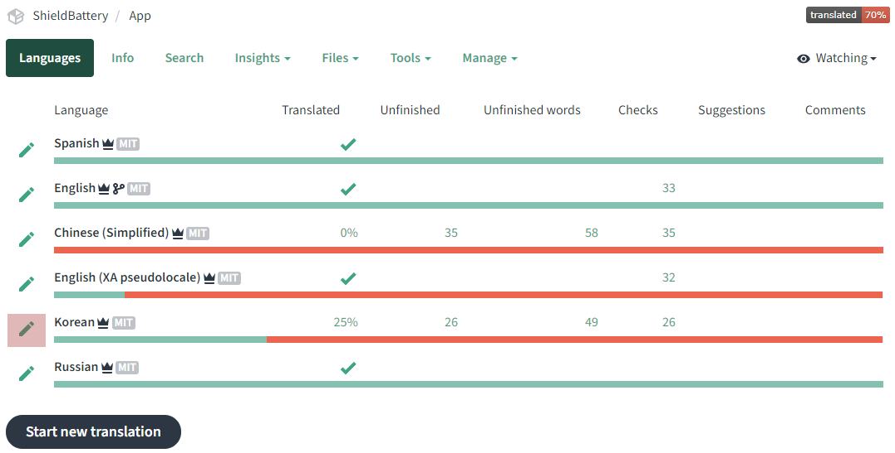
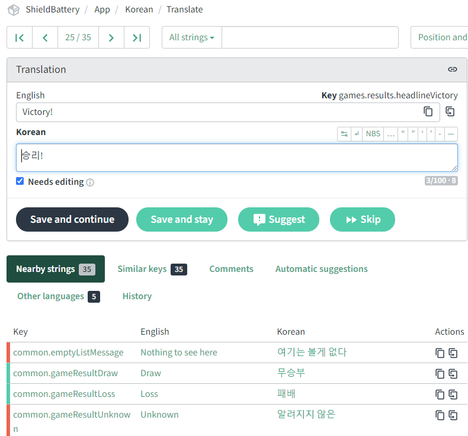
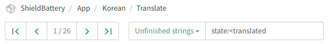
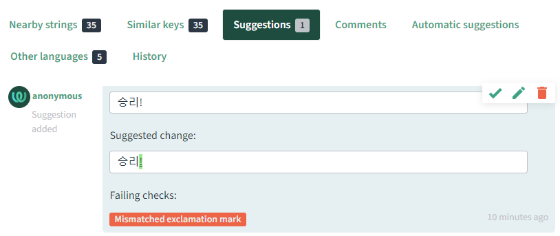

# Translation Guide

Helping with translation in ShieldBattery is easy! First, go to our Weblate portal at https://translation.shieldbattery.net/projects/shieldbattery/app/

You'll see a list of supported languages, along with their respective translation status. It looks like this:

## Starting Out

To begin, click on the pencil icon next to the language you want to translate (in the image above, a red background has been added for emphasis).

You will see a page that looks like this:

Near the top, in the "Translation" box, is the source English text. On the right margin is the "Key" - the internal label of the string, which may contain some context clues about where the text will appear in the app (generally we follow a format of `feature.section.uniqueStringLabel`, so for this example, we can deduce from `games.results.headlineVictory` that the "Victory" text will appear as a headline on the game results screen). The target language is below (in this example, "Korean"). The text is automatically generated by machine translation and by default marked by a "Needs editing" checkbox - simply enter the translation and uncheck the box, then click "Save and continue" (if Editor role) or "Suggest". If the listed translation is already correct, uncheck the box without changing the text, then click "Save and continue" (if Editor role) or "Suggest".

If you are not sure about a translation, simply leave "Needs editing" checked so that another translator can make the final call. You can also discuss in the ⁠translations channel in the ShieldBattery discord. Weblate only imports strings once "Needs editing" is unchecked and an Editor has pressed "Save and continue".

Near the bottom of the image are the list of strings. Rows in red denote an `unfinished` string ("Needs editing" is checked), while rows in green denote a `translated` string.

## Tips

The best player experience will come from proper localization of strings, rather than direct translation. If your regional community calls it "1:1" instead of "1v1", that's exactly what they'll be looking for, and that's what we want to present.

You can use the filter bar near the top of the page to search for various statuses, as found here:

Note that this only changes the filtered results at the top (the number on the left, "1 / 26" in the image), and not the list of strings below. You can navigate through the filtered results using the < and > buttons, and "Save and continue"/"Suggest" will always progress to the next filtered result.

(Editors only) Suggestions appear as a category filter above the list of strings, or in the "Strings with suggestions" filter at the top of the page. A suggestion looks like this:

Editors can choose to Accept ( ✅), Accept and Edit (📝), or Dismiss (🗑️) suggestions. Although anyone can submit suggestions for translation, only logged-in Weblate accounts flagged as Editors by ShieldBattery administrators can directly update strings.
