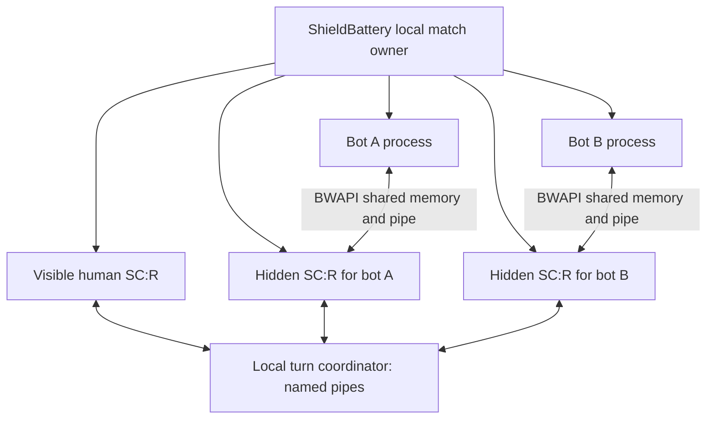

# Local BWAPI bot matches and later online play

Status: proposed implementation plan, 2026-09-21. The existing bridge is a working
development prototype; the local-match product described here is not implemented.
See [compatibility research](bwapi-compatibility-research.md) for completed tests.

## Product stages

1. **Local play:** one visible human SC:R client, one or more local bots, cached
   maps and bot packages, no remote match session or match traffic. Bot-owned game
   clients never become visible and stop when the human leaves. Include a curated
   catalog and a bring-your-own-bot path.
2. **Networked custom games:** the same bot packages can occupy named lobby slots,
   initially through a designated local runner. Hosting location is separate from
   bot identity and slot ownership.
3. **Opt-in ladder play:** registered bot identities and immutable submitted
   versions, explicit human matchmaking preference, and a controlled execution
   environment with an enforceable observation and resource policy.

Working interpretation of local play: after SC:R, maps, bots, and required runtimes
are installed, starting and completing the match does not require a ShieldBattery
backend, relay, login round trip, or network socket. Downloads are a separate
operation. This is stricter than simply keeping UDP traffic on localhost.

## What the prototype supplies, and what is missing

| Boundary         | Current evidence                                                                                                                                                            | Required work                                                                                                                         |
| ---------------- | --------------------------------------------------------------------------------------------------------------------------------------------------------------------------- | ------------------------------------------------------------------------------------------------------------------------------------- |
| BWAPI bridge     | ZZZKBot and UAlbertaBot source builds use the 4.4 external protocol. The bridge submits native synchronized commands and filters observations.                              | Broader command/query/event coverage, production enablement, explicit per-instance configuration.                                     |
| Launcher         | `app/game/active-game-manager.ts` has one `activeGame`. `game-server.ts` keys one socket by game ID.                                                                        | One match owner managing several game clients and bot processes, with distinct match/client/participant identities.                   |
| Setup            | `common/games/game-launch-config.ts` and `game/src/game_state.rs` expect a local SB user and server config.                                                                 | A local launch mode with local participant identities and cached map paths, without fabricated server accounts or result credentials. |
| Turns            | The sessionless path in `game_state.rs` supports one human plus built-in AI and rejects multiple humans without netcode v2 setup.                                           | A local multi-client turn provider and local lobby/start coordination. Sessionless alone does not synchronize separate SC:R clients.  |
| App IPC          | `app/game/game-server.ts` and `game/src/app_socket.rs` use localhost HTTP/WebSocket/TCP.                                                                                    | A named-pipe control channel for the socket-free local mode. Remote match networking remains a separate transport.                    |
| Process lifetime | The installed stimpack API exposes launch/inject and wait-for-exit. It creates SC:R suspended, but has no public job ownership, child environment, or hidden-start options. | Extend the native launcher before resuming the child, including ownership, explicit environment, and presentation mode.               |
| Bot discovery    | Stock BWAPIClient scans a global game table for an available endpoint. The current server names its mapping and pipe by PID.                                                | Deterministic pairing of each bot with its intended game client, including simultaneous startup, reconnect, and crash recovery.       |

## Local match architecture

Start with **one SC:R simulation per bot**, plus the human's visible game. This
matches the bridge's existing local-player model and preserves normal command
ownership. Treat it as the first architecture to validate, not proof that it is
the cheapest possible implementation.

Reuse the existing deterministic turn seam and ordered command application. A local
coordinator owns the common roster, seed, map identity, turn ordering, start barrier,
and participant departures. The reusable netcode v2 boundary submits outgoing turns,
replaces incoming turn sets, and supplies latency-pipe state. Its `TurnChannels`
currently come from the relay client; a local driver or a transport abstraction
must preserve self-echo, complete ordered turn sets, and lobby/start/leave signals.
The inert SNP provider and the sessionless channel sink cannot do this themselves.
Bot-controlled slots are external participants, not native `Computer` slots.

The coordinator must not obtain online relay credentials or report
local results to online matchmaking. Replays and match history stay local.

Introduce `matchId`, `gameClientId`, and local `participantId` separately. The
visible client, hidden clients, and bot processes share a match but are independently
addressable. Preserve SB user IDs for online identities; do not manufacture one
account per locally installed bot. A per-client runtime profile holds hidden/audio/
render behavior and the bot's assigned player. Avoid process-global environment
changes that accidentally enable BWAPI on the human client.

Pairing is a first-class requirement. For unchanged auto-discovering clients,
serialize endpoint publication and attachment, validate the connecting process,
and release the match start barrier only when every expected bot is attached.
A source-built client adapter can support an explicit endpoint as an additional
route. Merely starting several bots at once against the global game table is not
reliable pairing. A disconnected bot must not attach to another player's endpoint.

## Hidden clients and lifetime

Hidden is a launch contract, not a window hidden after it flashes on screen.
Start with a per-process profile that prevents visible windows, focus changes,
and audio while retaining the simulation and required message pumping. Then
measure and reduce rendering work. Skipping drawing must not skip game progression,
visibility updates, RNG work, or make a minimized client throttle simulation.
Removing graphics-device creation entirely is a separate experiment; do not promise
it before checking engine dependencies on both x86 and x64. The existing Forge
hide-window helper runs after the game loop, and the normal draw path still calls
the original renderer. Existing analysis-backed turn hooks are sufficient to start
the transport work; a safe rendering/audio suppression mode still needs investigation.

The match owner supervises SC:R, the bot executable or JVM, and helper children.
Use a Windows job with kill-on-close semantics, assigning children while suspended
before any can escape supervision. On human exit: request orderly match/bot shutdown,
allow a bounded learning-file flush, then terminate remaining owned children. App
crash, launch cancellation, and partial initialization must also leave no workers.
A bot crash should produce an explicit local outcome, not silently switch its
player to the built-in AI. Do not reuse the online `begin_local_only` continuation
as worker shutdown: that deliberately lets a remaining simulation keep playing.
Job ownership handles lifetime/resource accounting;
it is not a security sandbox. [Windows job-object documentation](https://learn.microsoft.com/en-us/windows/win32/procthread/job-objects).

Keep bot-specific settings, logs, terrain caches, and learning files separate from
the human's SC:R settings and from other bot instances. Packages are immutable;
writable state belongs to a persistent learning profile independent of package
release ID. Track state-format compatibility and the last writer release separately:
compatible updates retain history, migrations work on a copy with a preserved
snapshot, and incompatible updates must not discard old state. Profiles can be
associated with an SB user but are neither user IDs nor match/session identifiers.
Define how tournament-style `read` and `write` trees are promoted between games.
Concurrent instances must not write the same learning files. Expose a reset-learning
action that restores the selected compatible release's packaged baseline.

Measure startup time, steady-state CPU/GPU/RAM, and one/two/four-bot matches before
choosing a default bot-count limit. Hidden clients still run full simulations.

## Catalog, packages, and bring your own bot

Use one package/runtime contract for catalog bots and user-supplied bots. A package
records bot name/version/author, immutable source revision and artifact digest,
license and notices, BWAPI protocol/ABI family, runtime and architecture, executable
or JAR entry point, argument array, working directory, assets, writable directories,
allowed races, map/game-mode/opponent-count restrictions, and verified bridge version.
Separate file hashes/source provenance from a claim that all API behavior works.

The local **`../robotics-facility/` repository** holds the bot-package scaffold:
commit-pinned independent source checkouts, candidate metadata, draft package/catalog
schemas, and an initially empty release catalog. Its `docs/catalog-and-offline.md`
defines the proposed delivery and installed-state contract. Existing build recipes
remain in this repository until moved with their host code and notices.

Keep the remote catalog, cached catalog, and installed inventory separate. Show
cached entries immediately, refresh asynchronously when stale or explicitly requested,
and retain the last valid catalog after failure. Launch installed versions using
local package descriptors without a catalog fetch or login round trip. Updates are
explicit; a removed catalog entry does not silently uninstall an existing package.
Maps, game files, and required runtimes must also be present for offline play.

Prefer on-demand versioned downloads with integrity checks and atomic installation.
DigitalOcean Spaces is the proposed canonical delivery host, with provider-independent
HTTPS URLs so GitHub releases or mirrors remain possible. No public hosting has been
configured. Ship bot packages and permitted runtime components, not StarCraft
executables or game assets. Signed publication, installation, and app integration
remain implementation work.

Catalog admission requires reviewing the exact bot version, linked libraries,
assets, and distribution obligations. A tournament download or public source tree
is not itself redistribution permission. Publish required notices and corresponding
source/build material for distributed components. Keep download availability,
license approval, and compatibility verification as separate states. Hosting SC:R
on servers also requires a separate review of game licensing/operational terms.

Bring-your-own-bot should work early: choose an executable, JAR, or supported native
module plus a small manifest; validate runtime/ABI and launch it in an isolated work
directory. Show startup errors and logs. Allow replacing a developer's local build
between matches without publishing a catalog release. Native AIModule DLLs need an
appropriate surrogate/compiler/BWAPI ABI; accepting an arbitrary DLL is not supplied
by the present source-host recipe.

For Java, declare a tested major version and architecture **per bot package**.
Detect a suitable runtime and allow a per-bot Java path. If missing, offer an
appropriate installer link; a managed portable runtime can follow later. A modern
64-bit JVM is not automatically compatible with older JNI bots. Do not change global
Java settings. For example, [PurpleWave](https://github.com/dgant/PurpleWave) and
[Ecgberht](https://github.com/Jabbo16/Ecgberht) document 32-bit JDK 8. Inspect the
selected runtime's `java.specification.version` and `sun.arch.data.model` via
`java.exe -XshowSettings:properties -version`, then test the actual packaged bot.
Select a vendor installer matching those requirements; a generic latest-Java link
is insufficient. Verify available packages and runtime distribution terms before
pinning an installer or bundling a runtime.

Display race, play style, tested formats, resource needs, version, and a dated
strength estimate. Tournament rank is useful context, not a ShieldBattery MMR
conversion. Learning history can change a bot's effective strength. A bot assuming
one opponent must not be offered for an unsupported multi-opponent match.

## Candidate catalog, researched 2026-09-21

ZZZKBot and UAlbertaBot are the currently exercised integration baselines. The bots
below are candidates, **not verified compatible or approved distribution packages**.
Top-level licenses are only the first step; pin and audit each dependency and asset.
The user subsequently supplied a saved SSCAIT page. The
[snapshot review](sscait-bot-snapshot-2026-09-21.md) records its displayed Elo values,
status, entry aliases, and version caveats. It contains 292 entries, 114 enabled;
its separate rank column is blank. Stardust leads the displayed Elo values at 3445.
This is a saved-page observation, not a verified server-side measurement timestamp.
Monster, the BananaBrain race variants, Dragon, and WillyT warrant additional
investigation for strength, race coverage, or multi-opponent support. McRaveZ is the
active rated Zerg entry; do not confuse it with the disabled Protoss McRave entry.

| Candidate                                                         | Useful coverage                                                                    | Upstream license and remaining work                                                                                                                                                                                                                               |
| ----------------------------------------------------------------- | ---------------------------------------------------------------------------------- | ----------------------------------------------------------------------------------------------------------------------------------------------------------------------------------------------------------------------------------------------------------------- |
| [Stardust](https://github.com/bmnielsen/Stardust)                 | Strong Protoss candidate; native C++.                                              | [Custom license](https://github.com/bmnielsen/Stardust/blob/main/LICENSE) permits distribution with notices but requires written author permission for public tournament submissions. Assess public-ladder eligibility separately; inspect BWEM/FAP dependencies. |
| [PurpleWave](https://github.com/dgant/PurpleWave)                 | All-race Scala/JVM bot with tournament history; exercises an external Java client. | [MIT](https://github.com/dgant/PurpleWave/blob/master/license.md). Upstream requires 32-bit JDK 8; validate JBWAPI and bundled JAR dependencies.                                                                                                                  |
| [Steamhammer](https://www.satirist.org/ai/starcraft/steamhammer/) | All-race native bot derived from UAlbertaBot; broader strategy coverage.           | Author states inherited MIT license. Version 5.3.6 is the published candidate; older tournament versions' ratings do not describe that build. Audit its source archive and dependencies.                                                                          |
| [McRave](https://github.com/Cmccrave/McRave)                      | Additional native bot and strategic variety.                                       | [MIT](https://github.com/Cmccrave/McRave/blob/master/LICENSE). Confirm supported races/formats for the pinned build and test its command/query usage.                                                                                                             |
| [Ecgberht](https://github.com/Jabbo16/Ecgberht)                   | Terran Java bot; exercises BWAPI4J and native bridge loading.                      | Repository identifies GPL-3.0. README requires 32-bit Java and documents BWAPI 4.2; establish compatibility with the 4.4 bridge before admission and provide required source material.                                                                            |

Locutus is a possible later Protoss candidate; inspect its custom license and BWTA
map-cache requirements before packaging. BananaBrain and Microwave are interesting
strength/variety candidates, but this research did not establish author-controlled
redistribution terms. Treat their availability on tournament download pages as
insufficient permission. Travis plans author outreach; prepare requests for recommended versions,
attribution, redistribution, and competitive-use permission where needed. Track
local-play/distribution and public-ladder/tournament eligibility separately, with
the scope and versions covered by any author grant. No author outreach or catalog
publication has occurred as part of this research.

For Stardust in particular, local distribution and competitive submission are
separate decisions. Preserve its exact license, and obtain permission or clarification
before putting it into a public competition that may fall under that restriction.

## Later networked and ladder play

The local runner should expose lifecycle, assigned participant, package identity,
logs, and resource usage independently from its transport. That lets an online lobby
reserve a bot slot and delegate it to a host runner without creating another bot format.
All lobby members should see the bot name/version and execution owner before start.
Define disconnect/forfeit and result attribution for bots independently of human accounts.

Host-run bots are a useful first custom-game deployment. They cannot by themselves
establish competitive integrity: a desktop owner controls the runner and its memory.
For opt-in ladder bots, prefer controlled server execution with pinned package hashes,
isolated writable state, enforceable frame/CPU budgets, fair observations, replay/result
provenance, and a version-update/rating policy. A trusted hosting model, capacity and
cost measurements, and game-license review must precede ranked operation. Never
silently substitute a different bot version or match a non-opted-in human against a bot.

## Implementation checkpoints and acceptance

1. **Managed local session:** launch one visible SC:R and one hidden bot client,
   pair the bot explicitly, and own their process trees. Validate no window flash,
   audio, settings interference, or orphan on cancellation/crash/user exit.
2. **Offline local transport:** start and finish a human-versus-bot match with no
   backend/relay and no local-mode TCP/UDP sockets. Reuse deterministic turn handling;
   test common start state, command order, pause, departure, and replay playback.
3. **Multiple bots and BYO:** run two different bots concurrently; test correct
   pairing, simultaneous discovery, a bot disconnecting/reconnecting, incompatible
   packages, JVM selection, isolated learning, and bounded failure recovery.
4. **Broader catalog and efficient clients:** validate additional native and Java
   bots on a map corpus; add missing bridge semantics driven by real failures.
   Benchmark presentation suppression with identical simulations across x86/x64.
   Publish only packages whose compatibility and license obligations are checked.
5. **User-facing local flow:** select map/bots/races, install missing packages or
   select local ones, run offline, inspect results/logs, and clean up automatically.
6. **Online lobby runners**, followed separately by **opt-in ladder hosting**.

The next concrete engineering slice is checkpoints 1 and 2 with an existing bot.
The short-term product is not complete at that slice: multiple bots, BYO, catalog
coverage, runtime handling, and the local launch experience remain required work.
